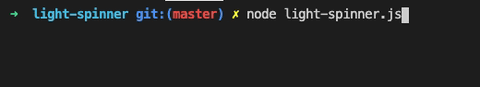

# light spinner

This is a no-dependencies minimal cli spinners, only 1KB.

Written by TypeScript.


## Install
```shell
$ npm i light-spinner --save
```
## Usage
```ts
import Spin from 'light-spinner';
const spin = new Spin({
  text: 'test',
});
spin.start();

// change text
spin.text = 'test 2';

spin.stop();
```

## Options
| option | type | desc | default |
| --- | --- | --- | --- |
| text | string | console text | empty string |
| timeout | number | the time of changing to next frame | 100(ms) |
| spinners | string[] | frame list | `['⠋', '⠙', '⠹', '⠼', '⠴', '⠦', '⠧', '⠏']` |


[MIT LICENSE](./LICENSE)